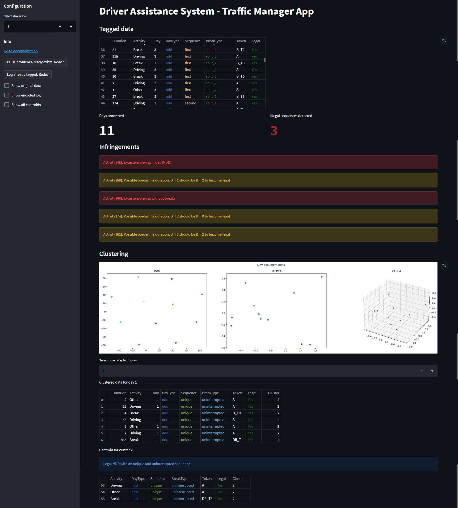

[](https://www.gnu.org/licenses/gpl-3.0)

# Driver Assistance System

A Driver Assistance System (DAS) to both help truck drivers and traffic managers. Some of functionality include:

- Monitoring and explaining driver activities in accordance with the Hours Of Service regulation.
- Identifying infringements and its cause.
- Suggesting new legal transport activities to fulfill deliveries based on driver preferences.
- Cluster driving sequences for an easy monitoring of driver behavior.

## :unlock: Requirements

### Setting the HTN planner

We use the SIADEX HTN planner based on HPDL. To install it, get it [here](https://github.com/IgnacioVellido/VGDL-to-HTN-Parser/tree/master/planners/Siadex), create a directory called ``planner`` under the root directory and compile it in there (a ``planner`` executable file should be generated)

### Setting everything else

We recommend using Anaconda and setting conda environment [environment.yml](./environment.yml) via the command:

```bash
conda env create -f environment.yml
```

Nevertheless, if you don't want to use Anaconda the main Python packages are:

- Python 3
- Numpy
- Gensim (4.1.2 or superior)
- Pandas
- Scikit-learn
- Matplotlib
- Streamlit (only for the apps)

## :computer: Usage

Each module can be called separately but we recommend using the GUI provided in the local web apps.

Please refer to the [wiki](https://github.com/IgnacioVellido/Driver-Assistance-System/wiki) for an explanation on how to call each module from the command line.

### Input data

Input data requires specific formatting, please see our [tachograph log example](data/driver.csv).

**Note**: We can only provide this small example dataset, but it's enough to test the functionality of this repo. If you want to further experiment with different data, please include each driver log separately as a ``driver<number>.csv`` into the ``data`` folder.

### Driver App


This app simulates the streaming data from a tachograph and displays useful metrics for the driver, as:

- Actual driving sequence and its compliance with the HOS regulation.
- Detected infringements and its cause.
- Next activities recommended for the day based on driver preferences.
- Remaining time before committing an infringement.

It can be launched via the command:

```bash
streamlit run ./src/driver-app.py
```

### Traffic Manager App



This app can be used to analyze historic tachograph data from a driver. It shows different information to understand the driver behavior and find undesirable patterns while driving.

It can be launched via the command:

```bash
streamlit run ./src/manager-app.py
```

## ⏲️ HOS Regulation

Detailed information about the regulation on which the project is based and the notation used in the output tags can be found [here](doc/HOS_regulation.md).

## :handshake: Contributing

We will gladly hear any feedback you may have, so don't be shy and open an issue whenever you want.
If you also want to contribute to this project please consider opening a PR. All contributions are welcome!
